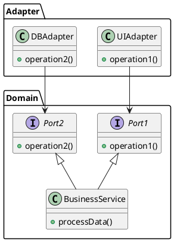

::right::

 
 
 

Primary- or "driving"-Adapter

<arrow v-click x1="480" y1="130" x2="200" y2="100" color="#953" width="2" arrowSize="1" />

 
 
 

Secondary- or "driven"-Adapter

<arrow v-click x1="480" y1="240" x2="345" y2="150" color="#953" width="2" arrowSize="1" />
