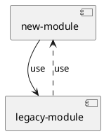

# Modules

 

## We *never* interact with the legacy app directly! We define ports in our new domain and connect to the legacy app exclusively through adapters.

::right::

# Dependencies

| **Module**      | **Dep-Type**  	 | **Module** 	    |
|-----------------|-----------------|-----------------|
| new-module 	    | compileTime     | legacy-module	  |
| legacy-module 	 | runTime         | new-module	     |

 

## Spring DI

The Spring-DI scans at runtime! The Spring-Bootstrap class can reside within the legacy application.