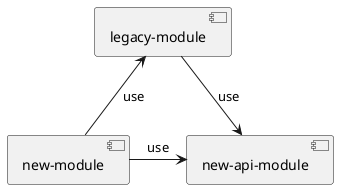
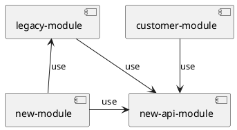

# Modules

 

::right::

# Dependencies
| **Module**      | **Dep-Type**  	 | **Module** 	    |
|-----------------|-----------------|-----------------|
| new-module 	    | compileTime     | legacy-module	  |
| new-module 	    | compileTime     | new-api-module	 |
| legacy-module 	 | compileTime     | new-api-module	 |
| legacy-module 	 | runTime         | new-module	     |

 

## Ports and Adapters
The new API module defines its own domain interfaces and entities, implemented by API adapters in the new module.